# 9-bit Differential SAR ADC — TSMC 65nm

> Full custom IC design, layout, and post-layout verification of a 9-bit differential Successive Approximation Register (SAR) ADC in TSMC 65nm, featuring a Razavi-style bootstrapped sampling network. Taped out as part of a 6-group collaborative top chip.

---

## Table of Contents

- [Overview](#overview)
- [Specifications](#specifications)
- [Architecture](#architecture)
- [Block-Level Design](#block-level-design)
  - [Bootstrapped Sampling Switch](#bootstrapped-sampling-switch)
  - [Capacitive DAC (CDAC)](#capacitive-dac-cdac)
  - [Comparator](#comparator)
  - [SAR Controller](#sar-controller)
  - [Output Buffers](#output-buffers)
- [Layout Methodology](#layout-methodology)
- [Verification & Simulation](#verification--simulation)
- [Top-Level Tape-Out](#top-level-tape-out)
- [Results](#results)
- [Tools Used](#tools-used)

---

## Overview

This project implements a **9-bit differential SAR ADC** designed and verified in TSMC 65nm using Cadence Virtuoso. The ADC uses a charge-redistribution CDAC architecture with a dynamic comparator and a fully synthesized digital SAR controller. A key focus of the design was improving linearity and SFDR through a custom bootstrapped sampling network, which holds the gate-source voltage of the input switches nearly constant across the full input swing.

The design was completed as part of a multi-group course project (ECE 266A) and was subsequently merged into a **6-ADC top-level chip for tape-out**, where I also contributed the output multiplexer, buffer array, and top-level physical verification.

---

## Specifications

| Parameter | Value |
|---|---|
| Resolution | 9-bit differential |
| Technology | TSMC 65nm |
| Supply Voltage | 1 V |
| SNDR (post-layout, with fillers) | 50.8 dB |
| SFDR (post-layout) | 60 dB |
| Power Consumption | 241 µW |
| Die Area | 399.2 × 341.5 µm |
| Comparator Offset (MC mean, FF) | < 3.2 mV |
| Comparator Offset (MC mean, SS) | < 1.8 mV |
| CDAC Capacitor Mismatch | < ±0.2% |
| Bootstrapped Switch V_GS Variation | ~25 mV |
| SFDR before bootstrapping | 43 dB |
| SFDR after bootstrapping | 59 dB (switch only) → 60 dB (full ADC) |

---

## Architecture

The ADC follows a standard **charge-redistribution SAR** architecture:

```
          ┌─────────────────────────────────────────────────┐
VIN+ ─────┤                                                 ├──── DOUT[9:0]
          │   Bootstrap  →  CDAC  →  Comparator  →  SAR     │
VIN- ─────┤ Switch Network           (dynamic)   Controller │
          └─────────────────────────────────────────────────┘
```

On each conversion cycle:
1. **Sample phase (CLK/S = SAMP):** The bootstrapped switches connect VIN to the top plates of the CDAC, sampling the differential input.
2. **Hold phase (CLKB/SB = HOLD):** The switches open; the CDAC top plates are held while the SAR controller performs a binary search by switching CDAC bottom plates between VDD and VSS.
3. **Comparison:** The comparator resolves the residue voltage at each bit cycle, feeding the result back to the SAR controller.
4. **Output:** The 9-bit result is available at DOUT after N comparison cycles.

---

## Block-Level Design

### Bootstrapped Sampling Switch

**Motivation:** In a standard NMOS sampling switch, the on-resistance R_ON depends on V_GS = V_G − V_IN. As V_IN swings, R_ON changes, introducing signal-dependent distortion that directly degrades SFDR. At 65nm supply voltages (1V), this effect is especially pronounced.

**Implementation:** Referencing [B. Razavi, "The Bootstrapped Switch," *IEEE Solid-State Circuits Magazine*, 2015](https://www.seas.ucla.edu/brweb/papers/Journals/BRSummer15Switch.pdf), a bootstrapped network was designed to dynamically boost the gate voltage in proportion to the input signal, holding V_GS approximately constant regardless of V_IN.

Key design features:
- A MOM capacitor (CB) is pre-charged to VDD during the hold phase across `cap_t` and `cap_b` nodes
- During the sample phase (CLK/S = SAMP), CB is stacked on top of VIN, driving the gate to VIN + VDD
- A "hot well" connection ties the body of the PMOS (M5) to its drain to prevent latch-up under boosted gate conditions
- A deep N-well NMOS (pwdnw) diode clamps against overvoltage on the gate node
- Switch array uses `nch` devices M2, M4, M8 as the core sampling transistors

<p align="center">
  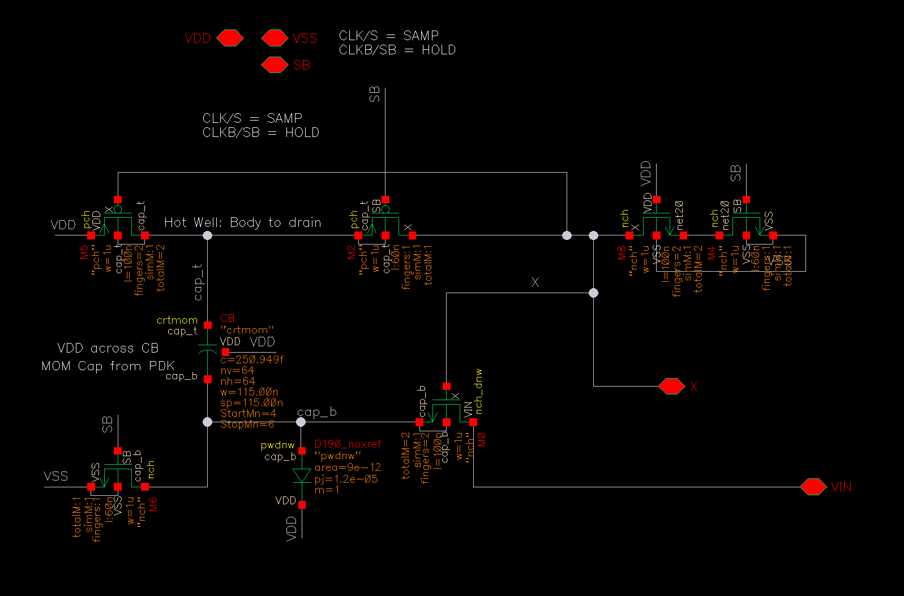
</p>

**Result:** V_GS variation was reduced to approximately **~25 mV** across the full input swing. The bootstrapped switch network alone improved SFDR from **43 dB to 59 dB**.

<p align="center">
  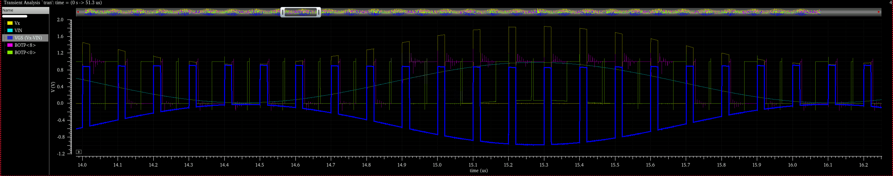
</p>

<p align="center">
  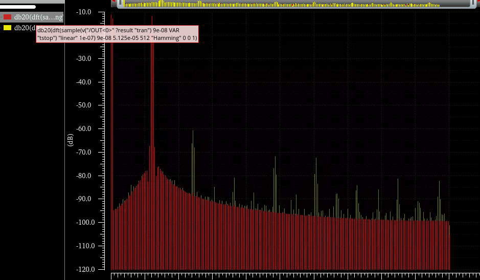
</p>

The red spectrum is with the bootstrapping network.

---

### Capacitive DAC (CDAC)

The CDAC uses a **binary-weighted capacitor array** with a unit capacitor derived from the TSMC 65nm MOM cap (crtmom). The differential structure uses two identical arrays for the positive and negative rails.

**Layout approach:** Rather than placing capacitors by hand, the CDAC array was generated using **Cadence SKILL scripts** (LLM-assisted scripting for layout automation). This allowed rapid iteration on placement and spacing while maintaining strict matching constraints.

Matching techniques applied:
- **Dummy capacitor ring** surrounding the entire array to give edge capacitors the same fringe environment as interior ones
- Iterative simulation-driven refinement to correct systematic gradients
- Final mismatch across all binary-weighted caps: **< ±0.2%** from ideal ratios except one of the lower bit cap

<p align="center">
  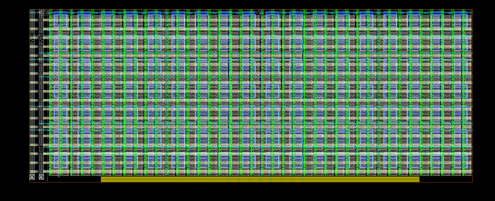
</p>

<p align="center">
  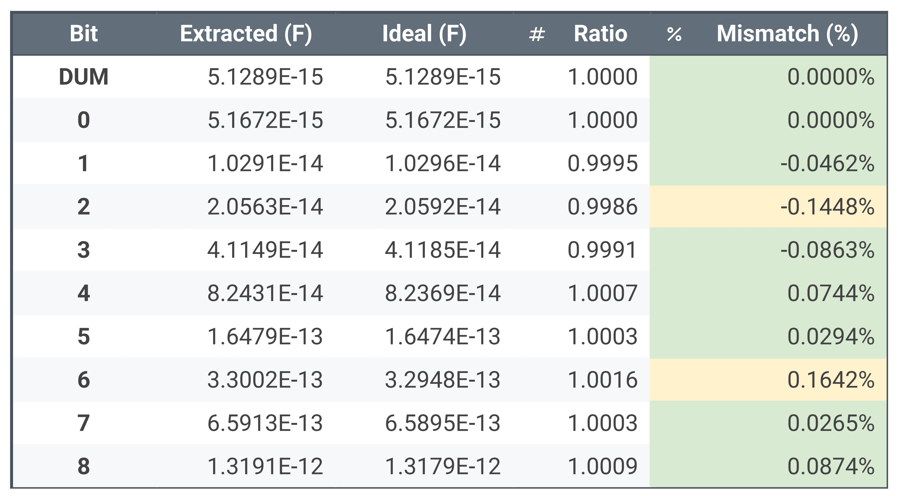
</p>

---

### Comparator

A **dynamic two-stage comparator [(Van Elzakker, JSSC 2010)](https://ris.utwente.nl/ws/files/6425321/VanElzakker-JSSC2010.pdf)** topology was used for the comparator, chosen for its zero static power and energy-efficient two-stage architecture, where a first-stage preamplifier reduces input-referred noise of the positive-feedback second stage, making it well-suited for SAR operation.

**Layout techniques:**
- **Common-centroid** placement of the differential input pair (M1/M2) to cancel first-order systematic offset due to process gradients
- **Dummy devices** placed around all active transistors and back-annotated into the schematic for accurate post-layout simulation
- **Guard rings** on all NMOS and PMOS wells to suppress substrate noise coupling from the digital SAR controller switching

**Simulation:**
- ADE L used to characterize propagation delay across process corners (global variation)
- ADE XL Monte Carlo (device mismatch + global process variation) run at FF and SS corners with N = 100 iterations

| Corner | Mean Offset | Propagation Delay |
|--------|------------|------------------|
| FF | < 3.20 mV | 261.0 ps |
| SS | < 1.80 mV | 491.2 ps |
| TT | < 2.48 mV | 342.2 ps |

<p align="center">
  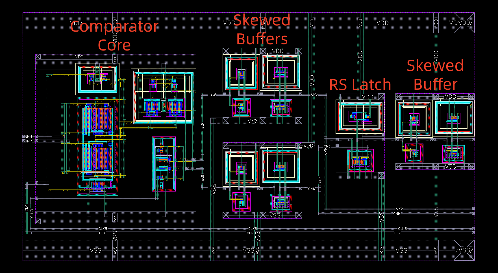
</p>

<p align="center">
  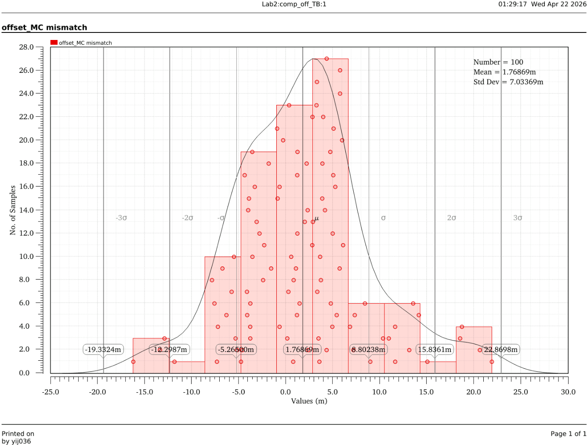
</p>

---

### SAR Controller

The digital SAR controller implements the binary search algorithm, generating the CDAC switching sequence and capturing the comparator output at each bit cycle.

**Design flow:**
- RTL written in **VerilogA**
- Synthesized using **Cadence Genus**
- Place-and-routed in **Cadence Innovus**
- **IO pin locations customized** to align with the comparator output and CDAC control inputs, minimizing routing length and reducing the area needed for interconnect

**6-to-1 Output MUX:** For the top-level tape-out, a **6-to-1 multiplexer** was also designed in VerilogA to select the 10-bit output from any of the six SAR ADCs on the top chip for readout through the shared pad ring.

<p align="center">
  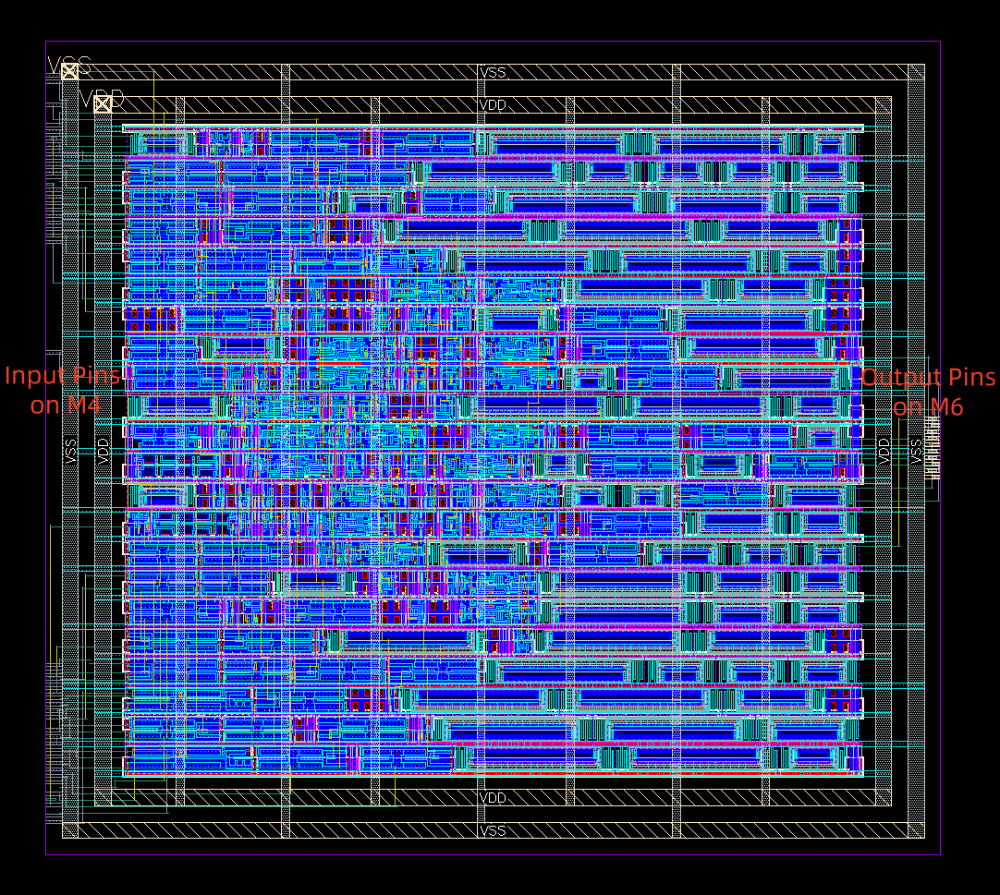
</p>

<p align="center">
  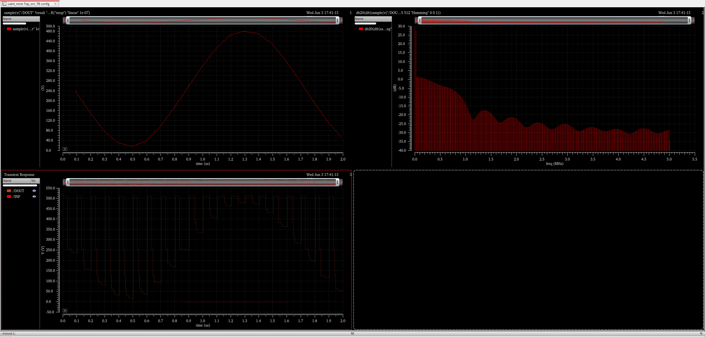
</p>

Top-chip level simulation using MUX's output, verifying the functionality of the SAR ADC with everything set up.

---

### Output Buffers

A **10-bit buffer array** was designed to drive the long on-chip traces from the SAR ADC digital outputs to the pad ring. Without buffering, signal integrity degrades along resistive metal traces at the distances involved in the top chip floorplan.

Buffer sizing was chosen to [*placeholder: describe sizing methodology — logical effort / fanout target*].

---

## Layout Methodology

Consistent layout practices were applied across all blocks:

| Practice | Purpose |
|---|---|
| Odd metal layers routed vertically | Minimize routing conflicts, match PDK conventions |
| Even metal layers routed horizontally | Orthogonal routing for clean DRC |
| Digital traces routed away from analog | Suppress switching noise coupling onto sensitive analog nodes |
| Matched trace lengths on analog nets | Equal RC delay and parasitics for differential signals |
| Guard rings on all well boundaries | Substrate noise isolation between analog and digital domains |
| Dummy devices on active blocks | Consistent local environment for every transistor |
| Common-centroid on differential pairs | First-order gradient cancellation for offset matching |

**Final ADC footprint:** 399.2 × 341.5 µm

<p align="center">
  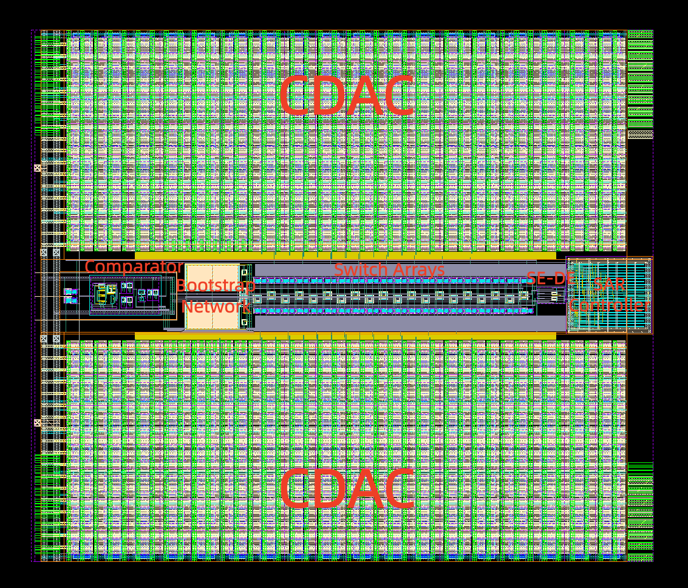
</p>

---

## Verification & Simulation

### Parasitic Extraction
Full **R + C + Cc** extraction was performed on all blocks using Calibre xRC prior to post-layout simulation.

### Simulation Runs

| Simulation | Tool | Purpose |
|---|---|---|
| SNDR & SFDR | ADE L (post-layout) | Full ADC performance with extracted parasitics, metal fillers, and DCAP cells |
| Comparator delay | ADE L | Propagation delay vs overdrive across corners |
| Comparator offset | ADE XL Monte Carlo | Device mismatch + global variation across FF and SS corners |
| CDAC mismatch | ADE L | Capacitor ratio deviation from ideal binary weights |

### DRC / LVS
- **DRC:** Passed (Calibre), including density and antenna rules
- **LVS:** Passed (Calibre), full schematic-vs-layout match on all blocks and top level

<p align="center">
  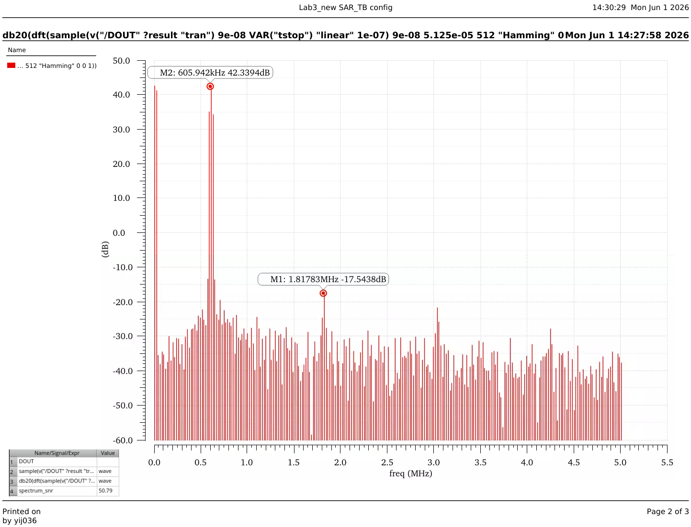
</p>

---

## Top-Level Tape-Out

The ADC was merged with five other groups' designs into a **6-ADC top chip** for physical tape-out.

**My contributions at the top level:**

- **6-to-1 output MUX** (VerilogA) — selects the 10-bit output from the desired ADC for testing
- **10-bit buffer array** — restores signal strength on long traces from ADC outputs to pads
- **Full chip DRC/LVS closure** — ran and helped resolving violations including density and antenna

<p align="center">
  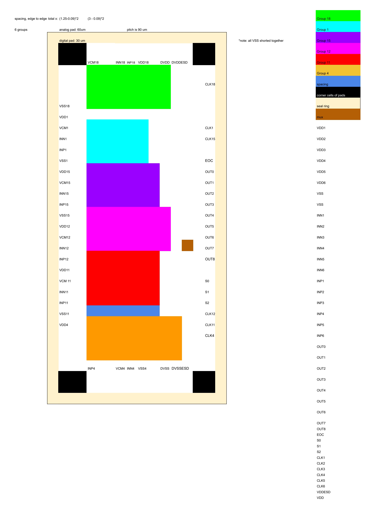&nbsp;&nbsp;&nbsp;&nbsp;&nbsp;&nbsp;&nbsp;&nbsp;&nbsp;&nbsp;&nbsp;&nbsp;
  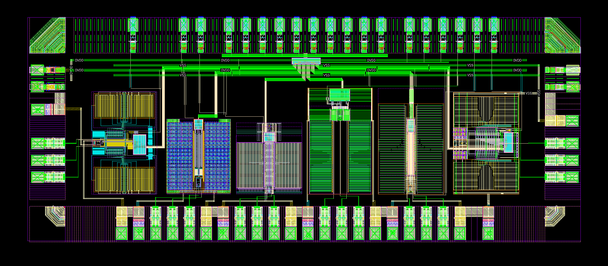
</p>

---

## Tools Used

| Tool | Usage |
|---|---|
| Cadence Virtuoso | Schematic entry, layout, analog simulation setup |
| Spectre / ADE L | DC, AC, transient, and post-layout simulation |
| ADE XL | Monte Carlo (mismatch + PVT corners) |
| Calibre xRC | R+C+Cc parasitic extraction |
| Calibre DRC / LVS | Design rule check and layout-vs-schematic |
| Cadence SKILL | CDAC array layout automation (LLM-assisted scripting) |
| VerilogA | SAR controller RTL, 6-to-1 MUX |
| Cadence Genus | SAR controller and MUX synthesis |
| Cadence Innovus | SAR controller and MUX place-and-route |

---

*9-bit Differential SAR ADC · TSMC 65nm · ECE 266A, UC San Diego*
